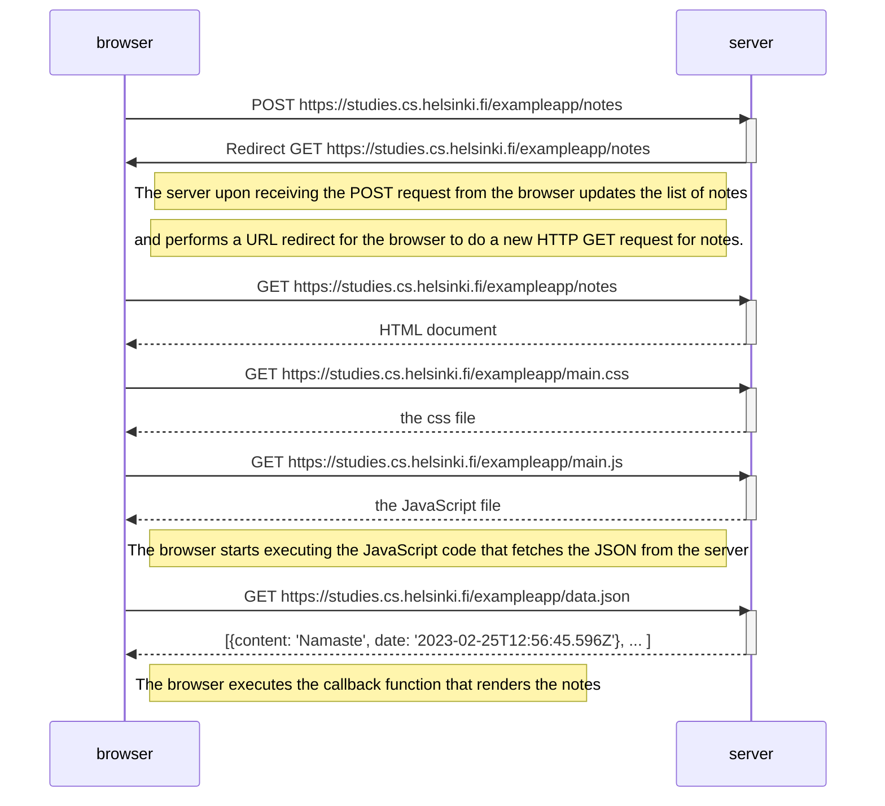

# 0.4 New Note Diagram 

## Diagram using the mermaid markdown syntax to depict the sequence of events caused by creating a new note

```mermaid
sequenceDiagram
    participant browser
    participant server

    browser->>server: POST https://studies.cs.helsinki.fi/exampleapp/notes
    activate server
    server->>browser: Redirect GET https://studies.cs.helsinki.fi/exampleapp/notes
    deactivate server

    Note left of server: The server upon receiving the POST request from the browser updates the list of notes
    Note left of server: and performs a URL redirect for the browser to do a new HTTP GET request for notes.

    browser->>server: GET https://studies.cs.helsinki.fi/exampleapp/notes
    activate server
    server-->>browser: HTML document
    deactivate server
    
    browser->>server: GET https://studies.cs.helsinki.fi/exampleapp/main.css
    activate server
    server-->>browser: the css file
    deactivate server
    
    browser->>server: GET https://studies.cs.helsinki.fi/exampleapp/main.js
    activate server
    server-->>browser: the JavaScript file
    deactivate server
    
    Note right of browser: The browser starts executing the JavaScript code that fetches the JSON from the server
    
    browser->>server: GET https://studies.cs.helsinki.fi/exampleapp/data.json
    activate server
    server-->>browser: [{content: 'Namaste', date: '2023-02-25T12:56:45.596Z'}, ... ]
    deactivate server    

    Note right of browser: The browser executes the callback function that renders the notes 
```