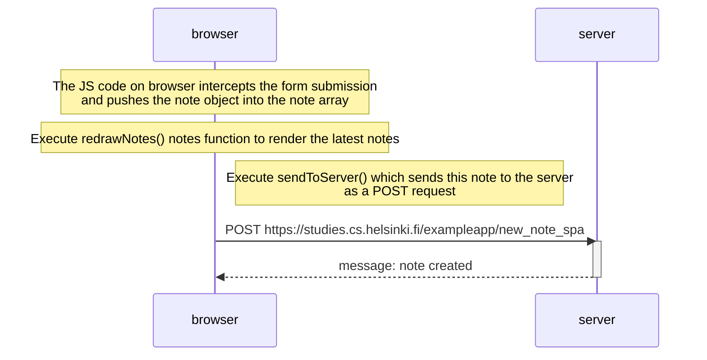

# 0.6 New note in Single page app diagram

## Diagram using the mermaid markdown syntax to depict the sequence of events where the user creates a new note using the single-page version of the app.

